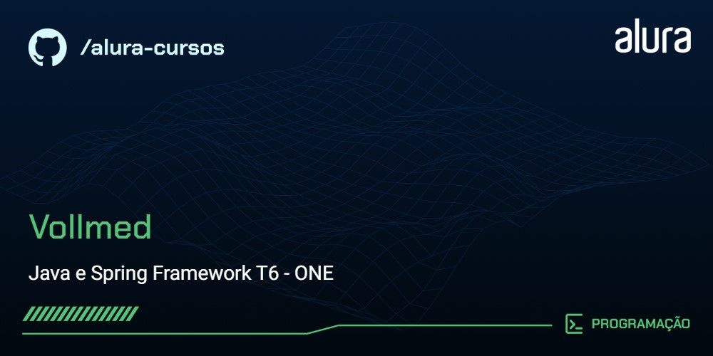

Vollmed é um projeto que tem como objetivo desenvolver uma API RESTful em Java, utilizando o banco de dados MySQL. Este projeto foca em várias funcionalidades essenciais para o desenvolvimento de uma aplicação robusta e segura.
## ⚙️ Funcionalidades
- CRUD Completo: Implementação das operações de Create, Read, Update e Delet
- Paginação: Configuração de paginação para exibir resultados de busca de maneira eficiente, melhorando a performance e a usabilidade da aplicação.
- Segurança: Implementação de várias configurações de segurança para proteger a aplicação e os dados dos usuários.
- Conexão com Banco de Dados: Integração com MySQL para armazenamento e recuperação de dados.
- Boas Práticas de Desenvolvimento: Adoção de práticas recomendadas para garantir a qualidade e a manutenibilidade do código.

## 🗂️ Tecnologias Utilizadas
- Java: Linguagem de programação principal.
- Spring Boot: Framework para facilitar a criação de aplicações Java.
- MySQL: Sistema de gerenciamento de banco de dados.
- Maven: Ferramenta de automação de compilação e gerenciamento de dependências.
- Spring Security: Framework de segurança para a aplicação.

## 📝 Licença
Este projeto está licenciado sob a Licença MIT.